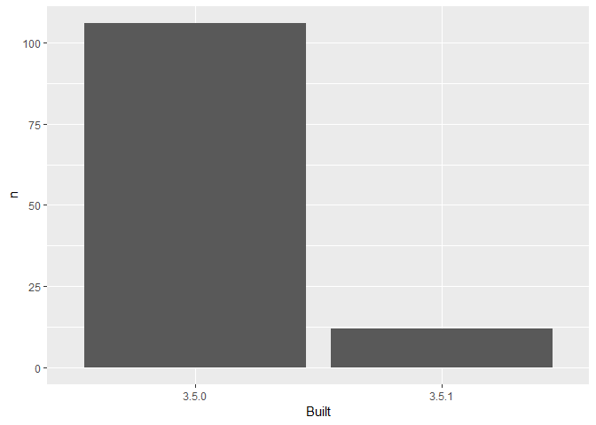

03\_barchart-packages-built.R
================
gclement
Thu Oct 04 15:21:34 2018

``` r
library(here)
```

    ## Warning: package 'here' was built under R version 3.5.1

    ## here() starts at C:/Users/gclement/Desktop/R Training/WhatTheyForgot_Seattle/explore-libraries

``` r
library(tidyverse)
```

    ## Warning: package 'tidyverse' was built under R version 3.5.1

    ## -- Attaching packages ------------------ tidyverse 1.2.1 --

    ## v ggplot2 3.0.0     v purrr   0.2.5
    ## v tibble  1.4.2     v dplyr   0.7.5
    ## v tidyr   0.8.1     v stringr 1.3.1
    ## v readr   1.1.1     v forcats 0.3.0

    ## Warning: package 'ggplot2' was built under R version 3.5.1

    ## -- Conflicts --------------------- tidyverse_conflicts() --
    ## x dplyr::filter() masks stats::filter()
    ## x dplyr::lag()    masks stats::lag()

``` r
## make a barchart from the frequency table in data/add-on-packages-freqtable.csv

## read that csv into a data frame
freqtable <- read.csv(here("data", "add-on-packages-freqtable.csv"))

## hint: readr::read_csv() or read.csv()
## idea: try using here::here() to create the file path

## if you use ggplot2, code like this will work:
ggplot(freqtable, aes(x = Built, y = n)) +
  geom_bar(stat = "identity")
```

<!-- -->

``` r
ggsave(here("figs", "built-barchart.png"))
```

    ## Saving 7 x 5 in image

``` r
## write this barchart to figs/built-barchart.png
## if you use ggplot2, ggsave() will help
## idea: try using here::here() to create the file path

## YES overwrite the file that is there now
## that came from me (Jenny)
```
